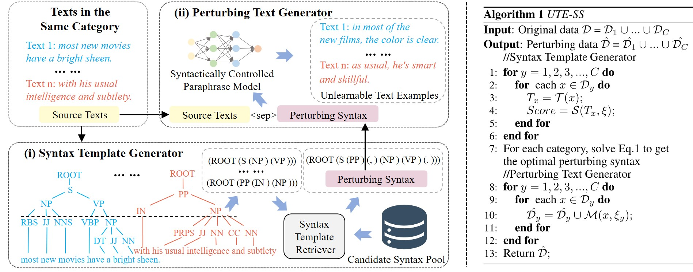

# Syntax-oriented Shortcut: A syntax level perturbing algorithm for preventing text data from being learned

This repository provides the source code for IJCAI2024 blind review.


## Introduction

In this paper, we propose incorporating the syntactic structure of texts and designing a novel Unlearnable Text Examples generation algorithm via Syntax-oriented Shortcut (UTE-SS).
Specifically, we propose a syntax template generator to generate the optimal perturbing syntax for a given category, which will realize imperceptible perturbations.
Then, a perturbing text generator is designed to perturb the in-class texts with the selected syntax template to stably deviate from the original texts.
Along this line, models will be misled to learn the shortcut between the syntax template and the category, so as to keep text examples unlearnable.
<div align=center>

</div>


## Dependencies

Here are the versions of packages we use for the implementation of experiments.


| Library          | Version  |
|------------------|----------|
| `Python`         | `3.9`    |
| `pytorch`        | `1.13.0` |
| `torchvision`    | `0.14.0` |
| `transformers`   | `4.33.2` |
| `pandas`         | `1.4.4`  |
| `nltk`           | `3.8.1`  |
| `rouge_score`    | `0.1.2`  |
| `spacy`          | `2.3.9`  |
| `en-core-web-sm` | `2.3.1`  |
| `gitpython`      | `3.1.30` |
| `sacrebleu`      | `2.3.1`  |


Due to the limitation of file size, we do not include the required syntactically controlled paraphrase model. Please download a syntactically controlled paraphrase model (e.g., [AESOP](https://github.com/PlusLabNLP/AESOP)), and put under AESOP directory.


## Generating Unlearnable Text Examples

For example, here is the command to generate unlearnable text examples for the SST-2 dataset:

```console
python main.py \
--directory_paser1=Store intermediate result path \
--directory_paser2=Store intermediate result path \
--deal_filename=Data to be processed \
--output_filename=Output result path \
--num_class=Number of categories in the dataset \
--pool=candidate syntax pool \
```


